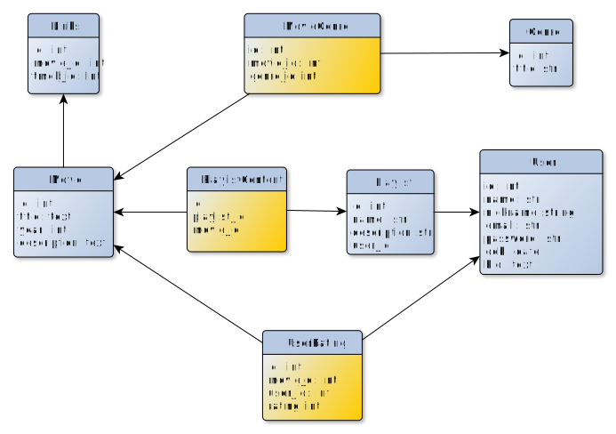
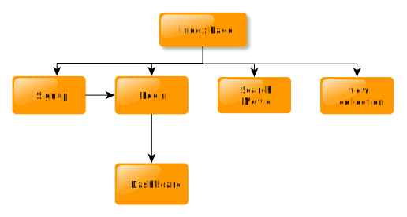

# **ChalChitra: Movie Recommender System** 
- This project is made for *Microsoft Engage 2022* and personal learning. The project delivers a solution to [Challenge 3](https://acehacker.com/microsoft/engage2022/#challenges) by presenting a working prototype of a Movie Recommendation System.  
- A good movie recommendation system, should be able to determine the user's interests. The same is achieved by using **collaborative filtering** which is a Machine Learning technique used to identify relationships between pieces of data.  

## Features
- User will be able to search for movies in the database
- Rate movies according to their liking
- Personalised Recommendations will be generated
- Jwt authentication for sessions

## Technologies Used 
This is a web application, with a machine learning model, which implements collaborative filtering. 
- **Frontend rendering & styling** : HTML, CSS
- **Backend handling**: Flask SQLAlchemy, Jwt Authentication
- **Machine Learning** : Python Pandas, H5py
- **Movie Dataset** : [MovieLens Small Dataset](https://www.kaggle.com/datasets/shubhammehta21/movie-lens-small-latest-dataset)

## Future Prospects
- functionality of creating and modifying playlist
- *Enhance Playlist* : recommending movies specific to that playlist
- Adding Filter based search
- Improving Modularity and Cosmetics of Application
- Deployment

## Naming Convention
| Type | Cases |
|------|-------|
| Classes | `PascalCase` |
| Objects | `camelCase` |
| Constants | `SCREAMING_SNAKE_CASE` |
| Variables | `snake_case` |
| Modules | `snake_case` |
| function | `snake_case` |
| Css Classes | `small-kebab-case` |

## Database Schema

## Application Flow

## Color Scheme

the [Color Theme](https://visme.co/blog/wp-content/uploads/2016/09/website6.jpg) has 6 colors :  

- `#000000`

- `#C7493A`

- `#A33327`

- `#689775`

- `#917164`

- `#AD8174`

## How to run locally 
- Clone the repository
- Make a vitrual environment and activate it(optional)
- Run `pip install -r requirements.txt`
- Run `flask run`
- Open `localhost:5000` on your browser
- Active Internet Connection is required
- **Note** : initial setup and takes 3-4 minutes due to preprocessing

## Making account
- To make an account, enter dummy credentials
- To login, enter email and password
- Some dummy users already have been made:

|email | password |
|------|-------|
| rbernardez0@stumbleupon.com | `PjOpUMP` |
| ebaggott6@msu.edu | `MwDT58P4W` |
| bbrithmang@cargocollective.com | `fo6hP2GqtuL` |
